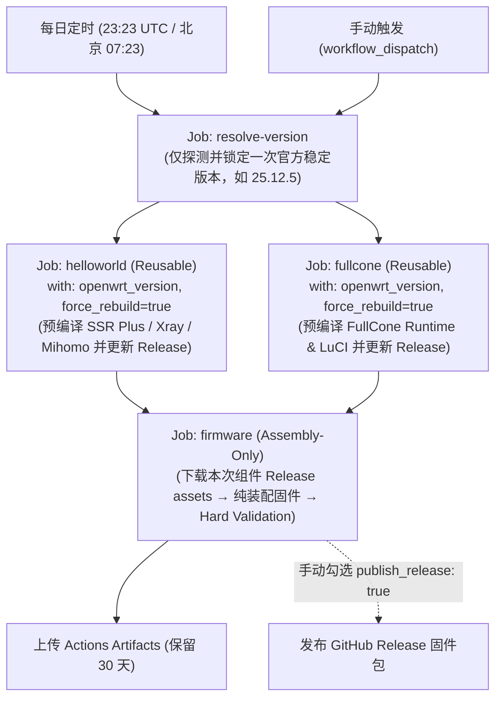

# OpenWrt x86_64 固件纯装配与自动化构建工程

基于 **OpenWrt 官方 ImageBuilder 与 SDK** 构建的高可用 x86_64 固件流水线。架构采用**编译与装配彻底解耦**的现代化设计：组件在官方同版 SDK 中独立预编译，固件流水线**仅执行纯装配（Assembly-Only，零组件编译与零 SDK 下载）**，兼顾极致的构建效率、确定性与内核 ABI 安全性。

支持 **GitHub Actions 云端定时/手动全链路编排** 与 **本地 Ubuntu / Debian / WSL2 秒级纯装配**。

---

## 🌟 核心特性

- **现代解耦架构（纯装配固件流水线）**：
  - **组件工厂（SDK）**：各第三方核心组件在匹配目标固件版本的官方 OpenWrt SDK 中独立预编译，生成标准签名的 Release APK 包并校验 SHA256。
  - **装配流水线（ImageBuilder）**：固件流水线不下载 SDK、不编译任何组件，仅拉取并验收对应版本的权威组件产物，调用官方 ImageBuilder 执行装配打包，构建耗时仅需 **1～3 分钟**。
- **动态版本锁定与防漂移机制**：
  - 全自动探测解析 OpenWrt 官方权威版本元数据（`downloads.openwrt.org/.versions.json`）；
  - 主流水线开始时**仅解析一次版本号**并单向透传给下游，彻底规避构建中途因官方版本切换导致的版本竞态与组件/内核 ABI 错配。
- **生产级 FullCone NAT 深度集成**：
  - 从 ImmortalWrt HEAD 提取 nftables FullCone NAT 供体补丁与源码；
  - 在完全同版 OpenWrt 官方 SDK 中重新编译 `kmod-nft-fullcone`、`libnftnl11`、`nftables-json`、`firewall4` 及 LuCI 界面（`luci-app-firewall`、`luci-i18n-firewall-zh-cn`）；
  - 内核 ABI 100% 匹配官方发行版内核，严禁使用 `--force-depends` 强行安装，并内置自研的真机运行时验收工具 [`fullcone-check`](files/usr/sbin/fullcone-check)。
- **SSR Plus 官方级无缝移植**：
  - 基于 [fw876/helloworld 官方 APK CI](https://github.com/fw876/helloworld) 流程源码编译 `luci-app-ssr-plus`、`xray-core`、`mihomo` 及简体中文语言包；
  - 按项目需求剥离 `naiveproxy`，并从同版 OpenWrt 官方源安全安装 `v2ray-geoip` 与 `v2ray-geosite`。
- **开箱即用的实用特性与驱动集成**：
  - **网络防冲突**：默认管理地址设为 `192.168.2.1`，避免与光猫默认 `192.168.1.1` 产生网段冲突；
  - **硬件与驱动**：集成 Realtek 2.5G (`r8125-rss`)、万兆 (`r8127-rss`) 网卡驱动及联发科 Wi-Fi 6/6E (`mt7921e`, `mt7922`) 固件；
  - **虚拟化增强**：预装 `qemu-ga` (QEMU Guest Agent) 与 `open-vm-tools`，原生适配 PVE、ESXi、FNOS（飞牛 OS）、KVM、Hyper-V 等虚拟化环境；
  - **流控与终端**：集成 SQM CAKE 智能抗缓冲膨胀流控调度，以及浏览器免客户端终端 `ttyd`；
  - **安全与授时**：Dropbear SSH 仅限局域网 LAN 口访问并启用公钥认证；预设阿里云、腾讯云、国家授时中心 NTP 服务池。
- **产物透明度与自动化差分报告**：
  - 自动记录每轮构建元数据（`BUILD-INFO.txt`）；
  - 自动比对生成软件包清单差异报告（`manifest.diff` / `manifest.md`），升级变动一目了然。

---

## 🏗️ 架构设计与 CI/CD 流水线

### 全链路编排拓扑 (DAG)



### GitHub Actions 三大标准入口

项目在 `.github/workflows/` 中精简规范为三个清晰的入口：

| 工作流入口 | 文件路径 | 触发方式 | 功能与特性 |
| :--- | :--- | :--- | :--- |
| **每日自动构建 OpenWrt 固件** | [daily-build.yml](.github/workflows/daily-build.yml) | 定时任务 (`23 23 * * *`)<br>手动触发 (`workflow_dispatch`) | **全链路主流水线**：单次解析版本 → 并行强制重编两大组件 → 阻断等待成功 → 零编译纯装配固件并上传 Artifacts。具备 `concurrency` 队列保护，绝不中断正在进行的构建。 |
| **构建 helloworld 预编译组件** | [build-helloworld.yml](.github/workflows/build-helloworld.yml) | 可复用调用 (`workflow_call`)<br>独立手动 (`workflow_dispatch`) | 独立预编译并发布 SSR Plus 产物包。支持 `force_rebuild` 参数（日常编排强制重编以吸收 packages feed 每日增量，独立手动支持缓存跳过优化）。 |
| **构建 FullCone 预编译组件** | [build-fullcone.yml](.github/workflows/build-fullcone.yml) | 可复用调用 (`workflow_call`)<br>独立手动 (`workflow_dispatch`) | 独立预编译并发布 FullCone runtime 及 LuCI 产物包。同样支持 `force_rebuild` 参数及完整性校验。 |

---

## 📁 项目目录结构

```text
.
├── .github/workflows/
│   ├── daily-build.yml           # 主流水线: 统一解析版本 / 并发预编译 / 固件纯装配
│   ├── build-helloworld.yml      # helloworld 预编译组件流水线 (可被复用 / 独立手动)
│   └── build-fullcone.yml        # FullCone 预编译组件流水线 (可被复用 / 独立手动)
├── config/
│   ├── custom-feeds.conf         # 第三方软件源列表 (支持 ${VERSION_SERIES} 动态分支)
│   └── extra-packages.txt        # 增量软件包清单 (支持行内与独立 # 注释)
├── files/                        # 自定义根文件系统覆盖目录 (装配时无损合入固件)
│   ├── etc/uci-defaults/         # 首次开机初始化脚本 (99-custom-defaults)
│   └── usr/sbin/                 # 固件内诊断工具 (fullcone-check)
├── scripts/
│   ├── build-firmware.sh         # 固件纯装配核心独立流水线 (Assembly-Only)
│   ├── resolve-version.sh        # OpenWrt 官方权威稳定版版本解析工具
│   ├── diff_manifest.py          # 软件包清单差分比对工具 (生成 diff 与 md 报告)
│   ├── setup-env.sh              # 宿主系统依赖环境检测与自动安装
│   └── setup-sdk.sh              # 组件编译共享 SDK 环境准备工具
├── components/
│   ├── helloworld-builder/       # SSR Plus / Xray / Mihomo 预编译组件 (build.sh)
│   └── fullcone-builder/         # FullCone runtime 与 LuCI 预编译组件 (build.sh, build-luci.sh)
├── tests/                        # 契约测试、装配断言、Rootfs 校验与 YAML 语法测试套件
├── Makefile                      # 常用构建命令快捷入口
└── README.md
```

---

## 🚀 快速上手

### 1. 云端构建 (GitHub Actions)

- **每日全自动编排**：每天**北京时间上午 07:23**（即 `23:23 UTC`）由主流水线自动触发，执行版本锁定、组件并发强制重编与固件纯装配。构建产物默认保存于 GitHub Actions Artifacts 中（保留 30 天），**默认不发布 Release**，避免日常构建污染 Release 页面。
- **纯净提交策略**：代码推送 (Push) 不触发任何构建，杜绝 Actions 额度浪费。
- **手动触发构建**：
  - **构建完整固件**：在 Actions -> **每日自动构建 OpenWrt 固件** 中点击 **Run workflow**：
    - `openwrt_version`: 默认 `latest`（自动探测最新稳定版），亦可指定如 `25.12.5`；
    - `rootfs_partsize`: 根分区大小，默认 `2048` MB (2GB)；
    - `publish_release`: 是否发布到 GitHub Releases（默认 `false` 不发布；需要正式发版时勾选为 `true`）。
  - **独立构建组件**：如需单独更新某一组件，可在对应的预编译工作流中独立触发。

### 2. 本地纯装配构建 (Ubuntu / Debian / WSL2)

本地构建推荐采用纯装配模式，速度极快（约 1 分钟）：

```bash
# 1. 检查并安装基本装配依赖
make env

# 2. 执行固件纯装配 (产物输出至 bin/ 目录)
make build

# 常用自定义参数示例:
ROOTFS_PARTSIZE=4096 make build        # 自定义根分区大小为 4GB
OPENWRT_VERSION=25.12.5 make build     # 指定特定版本进行构建
```

### 3. 构建产物说明 (`bin/`)

- `openwrt-*-x86-64-generic-squashfs-combined-efi-YYYYMMDD-HHMM.img.gz`：UEFI 引导固件压缩镜像
- `sha256sums`：SHA256 校验和文件
- `*.manifest`：固件集成软件包完整清单
- `manifest.diff` / `manifest.md`：软件包版本变动差异对比报告
- `helloworld-build-info.txt`：本次 helloworld 源码提交与编译目标元数据记录
- `fullcone-runtime-build-info.txt`：本次 ImmortalWrt donor、nft-fullcone 上游提交、内核 ABI 记录
- `fullcone-luci-build-info.txt`：本次 LuCI 稳定分支 commit 与补丁元数据记录

---

## 💻 默认系统配置与部署说明

| 配置项 | 默认值 / 策略说明 |
| :--- | :--- |
| **引导方式** | **UEFI (GPT)**（虚拟机创建时引导类型务必选择 UEFI / OVMF） |
| **默认后台地址** | `http://192.168.2.1`（已调整为 192.168.2.1，彻底避免与上级光猫冲突） |
| **子网掩码** | `255.255.255.0` |
| **默认账号** | `root` |
| **初始密码** | **无密码**（首次登录后请在 Web 界面或终端立即设置密码） |
| **IPv6 策略** | 默认关闭 WebUI 中的 WAN6、地址/前缀获取与 AAAA 应答；完整保留 IPv6 协议栈、软件包与防火墙规则，可在 WebUI 按需恢复 |
| **FullCone NAT** | 默认启用 IPv4 FullCone，IPv6 FullCone 保持关闭；可通过 Web 界面随时调整 |
| **SSH 安全机制** | Dropbear 仅绑定 LAN 口监听并默认禁用密码登录，仅允许公钥免密认证 |

### 快速部署步骤：
1. **解压固件**：将下载的 `.img.gz` 解压得到 `.img` 磁盘镜像文件；
2. **虚拟化部署**：在虚拟化平台（PVE / ESXi / KVM / 飞牛 OS 等）中导入为虚拟磁盘（推荐 VirtIO 总线，**引导模式务必设为 UEFI**）；
3. **物理机部署**：使用 Rufus、balenaEtcher 或 `dd` 将解压后的 `.img` 写入 U 盘或目标磁盘；
4. **访问管理**：网线接入设备的 LAN 口，浏览器打开 `http://192.168.2.1` 即可进入管理后台。

---

## 🔄 FullCone NAT 深度验证指南

固件中的 FullCone 链条采用**官方原版内核 ABI 级嫁接**，并在固件内置了生产级自检工具 `/usr/sbin/fullcone-check`。

### 内置验收工具：`fullcone-check`

```bash
# 1. 语法静态校验 (开机第一道防线，由 99-custom-defaults 首次启动自动调用)
fullcone-check syntax

# 2. 运行时状态诊断 (检查内核模块、fw4 规则集与当前活跃 ruleset 是否生效)
fullcone-check status

# 3. 热重载稳定性验收 (重启 firewall 服务并验证 ruleset 规则不丢失)
fullcone-check restart

# 4. LuCI 控制台 RPC 验证 (通过 ubus 验证 Web 前端能否识别 fullcone capability)
fullcone-check luci
```

### 手工核验证据链：

```bash
# 检查内核模块是否加载
lsmod | grep -i fullcone

# 检查 nftables 活跃规则集中是否包含 fullcone 规则
nft list ruleset | grep -i fullcone

# 查看 firewall4 规则输出
fw4 print | grep -i fullcone

# 查看 UCI 配置项
uci get firewall.@defaults[0].fullcone
```

---

## 🧪 静态测试与质量保证

本项目配备了完整的自动化回归与契约测试套件（`tests/`），严把质量关：

```bash
# 运行全部 57 项单元测试与契约测试 (包含 DAG 依赖、零 SDK 纯装配断言、YAML 唯一键校验等)
python3 -m unittest discover -s tests -v

# 验证所有 Shell 脚本语法
bash -n scripts/*.sh components/*/*.sh

# 检查 Git 格式与空白
git diff --check
```
