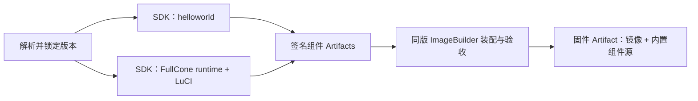

# openwrt-imagebuilder-ci

使用 OpenWrt 官方 SDK 预编译组件，再通过同版本官方 ImageBuilder 装配 x86_64 固件。支持 GitHub Actions 定时、手动构建，以及使用预编译组件进行本地装配。

组件归档和固件通过 **Actions Artifacts** 交付。固件内置签名组件软件源，部署后无需在线托管这些组件。

## 功能与支持范围

- 集成 FullCone NAT 运行时、LuCI 防火墙界面和诊断工具。
- 集成 SSR Plus、Xray、Mihomo 和对应中文语言包；GeoData 从同版本官方源安装。
- 集成 QEMU Guest Agent、SQM、网页终端及选定的网卡驱动，软件包清单可调整。
- 校验官方工具归档、组件签名、包身份、内核依赖和最终根文件系统，输出包清单与差分报告。

| 项目 | 当前范围 |
| --- | --- |
| 固件目标 | OpenWrt `x86/64`，默认 `generic` profile |
| 默认镜像 | UEFI、SquashFS，压缩的 `combined-efi.img.gz` |
| 构建环境 | Linux x86_64；CI 使用 Ubuntu，本地依赖脚本使用 Debian / Ubuntu 的 `apt-get` |
| Windows 本地构建 | 在 WSL2 的 Linux 环境中运行，建议把工作目录放在 Linux 文件系统内 |
| 发行版要求 | 使用 APK v3 / ADB 软件源，并提供 `.tar.zst` 格式的匹配 SDK 和 ImageBuilder |
| 版本一致性 | SDK、ImageBuilder、组件和目标固件须使用同一 OpenWrt 版本；内核模块另检查精确 ABI 依赖 |

当前实现未适配其他架构、使用 `opkg` 的旧版 OpenWrt 或 `snapshot`。`latest` 用于选择官方稳定版，新发行系列仍需确认工具格式、软件包和上游组件兼容性。脚本中的架构变量不代表已经支持跨架构构建。

## 快速开始

### 1. GitHub Actions 构建

1. 在自己的仓库中启用 GitHub Actions。
2. 打开 **Actions → 每日自动构建 OpenWrt 固件 → Run workflow**，选择分支和构建参数。
3. 等待组件构建、固件装配和验收完成，在该次运行的 **Artifacts** 下载固件。

| 输入 | 默认值 | 用途 |
| --- | --- | --- |
| `openwrt_version` | `latest` | 选择官方稳定版，或填写兼容的明确版本号 |
| `rootfs_partsize` | `2048` | 根分区大小，单位 MB；需容纳内置组件源及后续安装的软件包 |
| `grub_timeout` | `0` | GRUB 引导等待时间，单位秒 |

主工作流开始时解析一次版本，将结果传给两个组件工作流，再使用**本次运行**的组件产物装配固件。组件构建失败会阻止固件装配，提交代码不会自动触发构建。

定时配置为 `23 23 * * *`，即每天 **23:23 UTC / 北京时间次日 07:23**。如需调整时间，修改 [daily-build.yml](.github/workflows/daily-build.yml)。同组主工作流不并行运行，保留正在执行的构建。

工作流使用 `contents: read`；主工作流另有 `actions: read`。无需配置额外的 GitHub token，仓库可以保持私有。`CUSTOM_SIGNING_KEY` 为可选密钥，用于统一组件签名身份；未配置时使用 SDK 生成的密钥。

| 工作流 | 用途 | Artifact 保留期 |
| --- | --- | --- |
| [daily-build.yml](.github/workflows/daily-build.yml) | 完整构建与固件交付 | 固件 30 天 |
| [build-helloworld.yml](.github/workflows/build-helloworld.yml) | 独立构建 SSR Plus 相关组件，也供主工作流调用 | 组件 1 天 |
| [build-fullcone.yml](.github/workflows/build-fullcone.yml) | 独立构建 FullCone runtime 与 LuCI，也供主工作流调用 | 组件 1 天 |

独立组件构建只生成组件归档，不会更新已有固件。组件工作流中的 `force_rebuild` 输入目前不参与构建判断，每次运行都会编译组件。

### 2. 本地纯装配构建 (Ubuntu / Debian / WSL2)

在仓库根目录执行。先下载兼容且同版本的两份组件 Artifact，解开 Artifact 的下载包，取得其中的 `.tar.gz` 归档。归档须包含 APK、签名索引、公钥、安装约束和 `SHA256SUMS`；仅包含 APK 的旧归档不能直接使用。

以下归档路径是占位示例，请替换为实际文件位置。版本从组件构建信息读取，避免与下载的组件不一致。

```bash
make env

# 两个路径分别指向下载得到的 helloworld 和 FullCone 组件归档
HELLOWORLD_ARCHIVE="/path/to/helloworld.tar.gz"
FULLCONE_ARCHIVE="/path/to/fullcone.tar.gz"

mkdir -p .work/components/helloworld .work/components/fullcone
tar -xzf "${HELLOWORLD_ARCHIVE}" -C .work/components/helloworld
tar -xzf "${FULLCONE_ARCHIVE}" -C .work/components/fullcone

export HELLOWORLD_COMPONENT_DIR="${PWD}/.work/components/helloworld"
export FULLCONE_RUNTIME_DIR="${PWD}/.work/components/fullcone/runtime"
export FULLCONE_LUCI_DIR="${PWD}/.work/components/fullcone/luci"
export OPENWRT_VERSION="$(sed -n 's/^OpenWrt version: //p' "${HELLOWORLD_COMPONENT_DIR}/BUILD-INFO.txt")"

make build

# 沿用上述版本和组件路径，调整根分区大小与引导等待时间
ROOTFS_PARTSIZE=4096 GRUB_TIMEOUT=3 make build
```

`make env` 检查依赖并通过 `apt-get` 安装缺失项，需要相应权限。本地装配会下载官方 ImageBuilder 和普通软件包，组件 APK 则直接来自已准备的目录。

`make build` 不编译组件，也不自动下载 CI Artifact。多版本目录共存时，应像示例一样显式指定版本及三个组件路径；仅设置 `OPENWRT_VERSION=latest` 可能与已有组件不匹配。更换归档时使用空的解压目录，避免混入旧文件。

自行编译组件时，使用 [components/](components/) 下的构建脚本，并在编译后为每类组件执行签名源准备。命令格式为：

```text
bash scripts/prepare-component-feed.sh <feed-kind> <component-dir> <sdk-dir>
```

`feed-kind` 可选 `helloworld`、`fullcone-runtime` 或 `fullcone-luci`。组件构建输入和产物契约见 [仓库分析](docs/repository-analysis.md)。

## 配置与定制

| 配置入口 | 用途 |
| --- | --- |
| [config/extra-packages.txt](config/extra-packages.txt) | 增量软件包，每行一个名称；支持注释和 `-包名` 移除项 |
| [config/custom-feeds.conf](config/custom-feeds.conf) | 额外的构建期 APK 源，支持 `${VERSION_SERIES}` 替换；运行时源配置需另放入覆盖文件 |
| `config/keys/` | 额外构建期软件源的公钥；运行时需要的公钥也须随覆盖文件进入固件 |
| [files/](files/) | 根文件系统覆盖文件，路径对应固件根目录 |
| [99-custom-defaults](files/etc/uci-defaults/99-custom-defaults) | 首次初始化的网络、IPv6、FullCone、SSH、语言、时区、NTP 和主题设置 |
| [qemu-ga](files/etc/init.d/qemu-ga) | Guest Agent 的 procd 服务和通道检查 |

组件安装清单和身份约束由构建脚本生成，会覆盖增量清单中同名组件的选择。移除核心组件需要同步调整组件构建与验收规则。覆盖文件中也应保留验收要求的 QGA、FullCone 工具和初始化脚本。

常用本地装配变量如下，完整实现见 [build-firmware.sh](scripts/build-firmware.sh)：

| 变量 | 默认值 / 要求 | 用途 |
| --- | --- | --- |
| `OPENWRT_VERSION` | `latest`；本地建议与组件版号一致 | 目标 OpenWrt 版本 |
| `HELLOWORLD_COMPONENT_DIR` | 显式指定 | helloworld 组件目录 |
| `FULLCONE_RUNTIME_DIR` / `FULLCONE_LUCI_DIR` | 显式指定 | FullCone 的两个组件目录 |
| `ROOTFS_PARTSIZE` | `2048` | 根分区大小，单位 MB |
| `GRUB_TIMEOUT` | `0` | 引导等待时间，单位秒 |
| `WORK_DIR` / `BIN_DIR` | `.work/` / `bin/` | 工作缓存和交付目录 |
| `CONFIG_DIR` / `FILES_DIR` | `config/` / `files/` | 软件包配置和覆盖文件目录 |
| `BUILD_DATE` | 当前构建时间 | 产物文件名中的时间标识 |

`make help` 查看命令；`make clean` 清理 `bin/`，`make distclean` 同时删除 `.work/`。装配脚本也会清空指定的 `BIN_DIR`，应使用专门的交付目录。

## 构建产物与部署

| 产物 | 内容 |
| --- | --- |
| `*combined-efi*.img.gz` | 压缩的 UEFI 磁盘镜像，部署前解压为 `.img` |
| `sha256sums` | 镜像 SHA256 校验和 |
| `*.manifest` | 固件软件包及版本清单 |
| `manifest.diff` / `manifest.md` | 与历史 Manifest 的差分报告；无历史记录时作为首次基线 |
| `*-build-info.txt` | 三类组件的构建版本、源码提交和相关元数据 |

本地产物位于 `bin/`，CI 产物位于运行页面的 Artifacts。解压 Artifact 后，在包含镜像和校验文件的目录中执行：

```sh
sha256sum -c sha256sums
```

虚拟机使用 UEFI / OVMF 引导，并按平台要求导入磁盘镜像。物理机需支持 x86_64 和 UEFI，网卡等设备还需对应驱动。磁盘与网络设备的映射应根据实际硬件配置，不能按固定接口编号套用。

物理机部署时，将解压后的 `.img` 写入目标磁盘，再从该磁盘启动。写入会覆盖磁盘原有内容，执行前确认设备和目标磁盘。

当前初始化脚本提供以下预设，可在构建前修改对应覆盖文件，或部署后在 LuCI 中调整：

| 项目 | 默认设置 |
| --- | --- |
| LAN 管理地址 | `192.168.2.1/24`；部署前确认不与现有网络冲突 |
| WAN | PPPoE，账号和密码未预填；按实际接入方式调整 |
| 登录 | `root`，初始未设置密码；首次进入管理界面后设置密码 |
| SSH | 绑定 LAN，仅允许公钥认证；需要预置或上传自己的公钥 |
| IPv6 | 默认关闭相关地址请求、通告和 AAAA 应答，保留组件与恢复能力 |
| FullCone | IPv4 启用，IPv6 FullCone 关闭 |
| 界面与授时 | 简体中文、Footstrap 主题、`Asia/Shanghai` 时区及国内 NTP 预设 |
| QEMU Guest Agent | 服务启用，有对应字符设备通道时启动代理进程 |

这些是本仓库的配置选择，应根据网络、地区和运行环境调整。首次初始化脚本不等于每次启动强制覆盖配置；升级保留配置时，实际设置可能延续旧系统。

## 内置 `@custom` 软件源

固件把组件 APK 与签名索引保存在 `/usr/share/custom-apk/<kind>/`，公钥位于 `/etc/apk/keys/`。`/etc/apk/repositories.d/custom-components.list` 引用三份本地索引：

```text
@custom file:///usr/share/custom-apk/helloworld/helloworld-packages.adb
@custom file:///usr/share/custom-apk/fullcone-runtime/fullcone-runtime-packages.adb
@custom file:///usr/share/custom-apk/fullcone-luci/fullcone-luci-packages.adb
```

每份索引和 APK 均严格验签。定制包以 `name@custom><Q1...=` 固定安装身份，避免普通装包或升级时被官方同名包替换。组件源与这份固件固定匹配，不会自动追踪新的组件版本。

内置源读取无需联网，普通包及其依赖仍从 OpenWrt 官方源获取。完整 APK 会增加镜像和根文件系统占用；请保留内置目录、源配置和公钥。Actions Artifact 到期不影响已部署固件读取组件源。

在 OpenWrt 内检查：

```sh
cat /etc/apk/repositories.d/custom-components.list
ls /usr/share/custom-apk/*/
apk update
apk add --simulate coremark
```

更新仓库代码不会修改已有固件。组件或内核变更后，应构建并部署匹配的新固件；手工恢复旧固件的源，需要使用与已安装组件身份、公钥和内核 ABI 一致的原始产物。

## QEMU Guest Agent 部署与验收

固件安装官方 `qemu-ga` 和依赖 `virtio-console-helper`。宿主机需提供名为 `org.qemu.guest_agent.0` 的 VirtIO serial 通道；仓库的 [服务脚本](files/etc/init.d/qemu-ga) 仅在 `/dev/virtio-ports/org.qemu.guest_agent.0` 为字符设备时启动进程。没有该通道的设备，服务启用但未运行属于预期状态。

在客户机中检查：

```sh
test -c /dev/virtio-ports/org.qemu.guest_agent.0
/etc/init.d/qemu-ga enabled
/etc/init.d/qemu-ga status
logread -e qemu-ga
```

配置宿主通道后，完全关闭并重新启动虚拟机，再检查代理状态。宿主侧实际查询成功才说明通信可用。

### Proxmox VE 示例

先正常关闭虚拟机，在其选项中启用 QEMU Guest Agent，再启动。该设置需要一次完整启动才能生效，参见 [PVE 官方说明](https://github.com/proxmox/pve-docs/blob/master/qm.adoc#qemu-guest-agent)。以下在宿主机执行，将 `vm_id` 改为实际 ID：

```sh
vm_id=100
qm set "${vm_id}" --agent enabled=1
qm start "${vm_id}"
qm guest cmd "${vm_id}" ping
qm guest cmd "${vm_id}" network-get-interfaces
```

### libvirt 示例

在虚拟机 XML 的 `<devices>` 中配置通道，关闭并重新启动虚拟机。完整参数见 [libvirt Channel 文档](https://libvirt.org/formatdomain.html#channel)。

```xml
<channel type='unix'>
  <target type='virtio' name='org.qemu.guest_agent.0'/>
</channel>
```

其他 QEMU / KVM 平台按其通道配置方式操作。VMware 平台使用自己的客户机集成工具，QGA 不提供 VMware Tools 功能。

## 验证与常见问题

固件构建会检查组件清单、FullCone 内核依赖、运行时文件和 QGA 服务，并在 rootfs 副本中执行 `apk update` 与普通包模拟安装。部署后仍需验证实际网络和宿主通信。

FullCone 的设备端检查使用 [fullcone-check](files/usr/sbin/fullcone-check)：

```sh
fullcone-check syntax   # 加载模块，检查内核表达式和 fw4 生成规则
fullcone-check status   # 检查当前活动规则集
fullcone-check luci     # 检查 LuCI capability 与活动规则
fullcone-check restart  # 重启防火墙并检查规则，可能短暂影响连接
```

开发回归测试：

```sh
python3 -m unittest discover -s tests -v
```

测试使用真实 APK v3 工具和临时密钥，默认从 `.work/` 查找 SDK / ImageBuilder，也可设置 `CUSTOM_FEED_APK` 指定工具路径。需要 `openssl`；ImageBuilder 参数检查还需要对应 Makefile 和 GNU make。缺少前置条件时相关测试会跳过，跳过不等于验证通过。

| 现象 | 检查方向 |
| --- | --- |
| 本地缺少组件或签名索引 | 确认 Artifact 已解压，目录中含签名源完整文件；自行编译后需执行源准备脚本 |
| 版本、架构或内核依赖不匹配 | 使用同版本工具和组件，核对 `BUILD-INFO.txt`；不要强制忽略依赖 |
| `missing repository tags` | 检查内置 APK / 索引、三条 `@custom` 配置、公钥与已安装身份是否匹配 |
| 官方包安装失败 | 检查设备 DNS、时间和官方源连通性；内置组件源不提供所有官方包 |
| QGA 未运行 | 检查宿主 Agent 通道及客户机字符设备；无通道设备可保持未运行 |
| 修改代码后重跑仍使用旧逻辑 | 在目标分支新建工作流运行，重跑旧运行仍使用原提交 |

## 仓库结构与进一步阅读

```text
.github/workflows/   # 主工作流与两个组件工作流
components/         # SDK 组件构建脚本及补丁
config/             # 增量包、额外源与公钥配置
files/              # 固件覆盖文件和首次初始化脚本
scripts/            # 工具准备、签名源准备、装配与验收
tests/              # APK 源与 ImageBuilder 参数回归
docs/               # 架构分析、产物契约和验证边界
Makefile            # 构建、依赖检查与清理入口
```


```mermaid
flowchart LR
    version["解析并锁定版本"] --> hw["SDK：helloworld"]
    version --> fc["SDK：FullCone runtime + LuCI"]
    hw --> components["签名组件 Artifacts"]
    fc --> components
    components --> assembly["同版 ImageBuilder 装配与验收"]
    assembly --> firmware["固件 Artifact：镜像 + 内置组件源"]
```

详细实现、组件契约、构建验收及已知限制见 [docs/repository-analysis.md](docs/repository-analysis.md)。
