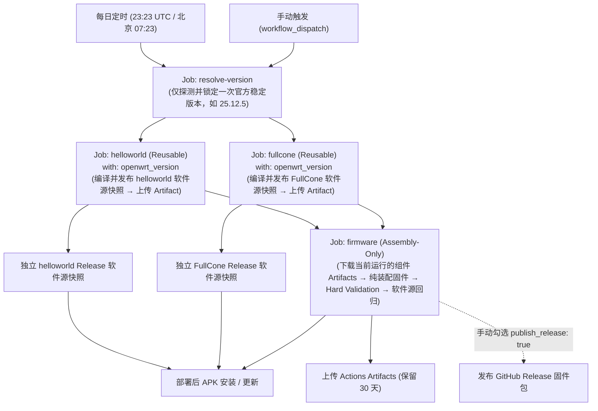

# OpenWrt x86_64 固件纯装配与自动化构建工程

基于 **OpenWrt 官方 ImageBuilder 与 SDK** 构建的高可用 x86_64 固件流水线。架构采用**编译与装配彻底解耦**的现代化设计：组件在官方同版 SDK 中独立预编译，固件流水线**仅执行纯装配（Assembly-Only，零组件编译与零 SDK 下载）**，兼顾极致的构建效率、确定性与内核 ABI 安全性。

支持 **GitHub Actions 云端定时/手动全链路编排** 与 **本地 Ubuntu / Debian / WSL2 纯装配**。

---

## 🌟 核心特性

- **现代解耦架构（纯装配固件流水线）**：
  - **组件工厂（SDK）**：各第三方核心组件在匹配目标固件版本的官方 OpenWrt SDK 中独立预编译，随后显式签署 APK 并生成安装约束和 SHA256 清单，发布独立的 GitHub Release 软件源快照，并将索引、URL 与公钥打包为当前工作流运行的 Actions Artifacts。
  - **装配流水线（ImageBuilder）**：固件流水线不下载 SDK、不编译任何组件，仅拉取并验收对应版本的权威组件产物，调用官方 ImageBuilder 执行装配打包。
- **动态版本锁定与防漂移机制**：
  - 全自动探测解析 OpenWrt 官方权威版本元数据（`downloads.openwrt.org/.versions.json`）；
  - 主流水线开始时**仅解析一次版本号**并单向透传给下游，彻底规避构建中途因官方版本切换导致的版本竞态与组件/内核 ABI 错配。
- **生产级 FullCone NAT 深度集成**：
  - 从 ImmortalWrt HEAD 提取 nftables FullCone NAT 供体补丁与源码；
  - 在完全同版 OpenWrt 官方 SDK 中重新编译 `kmod-nft-fullcone`、`libnftnl11`、`nftables-json`、`firewall4` 及 LuCI 界面（`luci-app-firewall`、`luci-i18n-firewall-zh-cn`）；
  - 内核 ABI 100% 匹配官方发行版内核，严禁使用 `--force-depends` 强行安装，并内置自研的真机运行时验收工具 [`fullcone-check`](files/usr/sbin/fullcone-check)。
- **可持续安装软件的 `@custom` 源**：
  - 每次组件构建发布按 OpenWrt 版本、架构、运行 ID 和尝试次数命名的独立软件源快照；
  - 固件内置三份签名索引的 HTTPS 地址及对应公钥，保留 `@custom` 和定制包身份约束，安装普通官方软件包时继续使用匹配的组件源；
  - 组件软件源保存在 GitHub Releases，不受 Actions Artifacts 的 1 天保留期影响。
- **SSR Plus 官方级无缝移植**：
  - 基于 [fw876/helloworld 官方 APK CI](https://github.com/fw876/helloworld) 流程源码编译 `luci-app-ssr-plus`、`xray-core`、`mihomo` 及简体中文语言包；
  - 按项目需求剥离 `naiveproxy`，并从同版 OpenWrt 官方源安全安装 `v2ray-geoip` 与 `v2ray-geosite`。
- **开箱即用的实用特性与驱动集成**：
  - **网络防冲突**：默认管理地址设为 `192.168.2.1`，避免与光猫默认 `192.168.1.1` 产生网段冲突；
  - **硬件与驱动**：集成 Realtek 2.5G (`r8125-rss`)、万兆 (`r8127-rss`) 网卡驱动及联发科 Wi-Fi 6/6E (`mt7921e`, `mt7922`) 固件；
  - **流控与终端**：集成 SQM CAKE 智能抗缓冲膨胀流控调度，以及浏览器免客户端终端 `ttyd`；
  - **虚拟机管理**：集成官方 `qemu-ga`，为 PVE / QEMU / KVM 提供客户机信息查询和管理通道；没有 Guest Agent 字符端口的实体机保持服务启用，但不启动代理进程；
  - **安全与授时**：Dropbear SSH 仅限局域网 LAN 口访问并启用公钥认证；预设阿里云、腾讯云、国家授时中心 NTP 服务池。
- **产物透明度与自动化差分报告**：
  - 自动记录每轮构建元数据（`BUILD-INFO.txt`）；
  - 自动比对生成软件包清单差异报告（`manifest.diff` / `manifest.md`），升级变动一目了然。

---

## 🏗️ 架构设计与 CI/CD 流水线

### 全链路编排拓扑 (DAG)


```mermaid
flowchart TD
    schedule["每日定时 (23:23 UTC / 北京 07:23)"] --> resolve["Job: resolve-version<br/>(仅探测并锁定一次官方稳定版本，如 25.12.5)"]
    dispatch["手动触发 (workflow_dispatch)"] --> resolve

    resolve --> helloworld["Job: helloworld (Reusable)<br/>with: openwrt_version<br/>(编译并发布 helloworld 软件源快照 → 上传 Artifact)"]
    resolve --> fullcone["Job: fullcone (Reusable)<br/>with: openwrt_version<br/>(编译并发布 FullCone 软件源快照 → 上传 Artifact)"]

    helloworld --> firmware["Job: firmware (Assembly-Only)<br/>(下载当前运行的组件 Artifacts → 纯装配固件 → Hard Validation → 软件源回归)"]
    fullcone --> firmware
    helloworld --> hwfeed["独立 helloworld Release 软件源快照"]
    fullcone --> fcfeed["独立 FullCone Release 软件源快照"]
    hwfeed --> runtime["部署后 APK 安装 / 更新"]
    fcfeed --> runtime
    firmware --> runtime

    firmware --> artifacts["上传 Actions Artifacts (保留 30 天)"]
    firmware -.->|"手动勾选 publish_release: true"| release["发布 GitHub Release 固件包"]
```

### GitHub Actions 三大标准入口

项目在 `.github/workflows/` 中精简规范为三个清晰的入口：

| 工作流入口 | 文件路径 | 触发方式 | 功能与特性 |
| :--- | :--- | :--- | :--- |
| **每日自动构建 OpenWrt 固件** | [daily-build.yml](.github/workflows/daily-build.yml) | 定时任务 (`23 23 * * *`)<br>手动触发 (`workflow_dispatch`) | **全链路主流水线**：单次解析版本 → 并行强制重编两大组件 → 阻断等待成功 → 零编译纯装配固件 → 验收与软件源回归 → 上传 Artifacts。具备 `concurrency` 队列保护，绝不中断正在进行的构建。 |
| **构建 helloworld 预编译组件** | [build-helloworld.yml](.github/workflows/build-helloworld.yml) | 可复用调用 (`workflow_call`)<br>独立手动 (`workflow_dispatch`) | 每次编译 SSR Plus 组件，校验后发布长期组件软件源，再上传 Actions Artifact（保留 1 天）。缓存用于构建工具与源码下载；当前 `force_rebuild` 输入未参与执行判断。 |
| **构建 FullCone 预编译组件** | [build-fullcone.yml](.github/workflows/build-fullcone.yml) | 可复用调用 (`workflow_call`)<br>独立手动 (`workflow_dispatch`) | 每次依次编译 FullCone runtime 与 LuCI，校验后发布长期组件软件源，再上传 Actions Artifact（保留 1 天）。当前 `force_rebuild` 输入未参与执行判断。 |

---

## 📁 项目目录结构

```text
.
├── .github/workflows/
│   ├── daily-build.yml           # 主流水线: 统一解析版本 / 并发预编译 / 固件纯装配
│   ├── build-helloworld.yml      # helloworld 预编译组件流水线 (可被复用 / 独立手动)
│   └── build-fullcone.yml        # FullCone 预编译组件流水线 (可被复用 / 独立手动)
├── config/
│   ├── custom-feeds.conf         # 第三方软件源列表 (支持 ${VERSION_SERIES} 动态分支)
│   └── extra-packages.txt        # 增量软件包清单 (支持行内与独立 # 注释)
├── files/                        # 自定义根文件系统覆盖目录 (装配时无损合入固件)
│   ├── etc/init.d/qemu-ga        # 基于官方 procd 服务，补充 Guest Agent 字符端口检查
│   ├── etc/uci-defaults/         # 首次开机初始化脚本 (99-custom-defaults)
│   └── usr/sbin/                 # 固件内诊断工具 (fullcone-check)
├── docs/repository-analysis.md   # 仓库架构、构建契约、验收与已知限制分析
├── scripts/
│   ├── build-firmware.sh         # 固件纯装配核心独立流水线 (Assembly-Only)
│   ├── prepare-component-feed.sh # 签署 SDK APK，生成签名索引、身份约束与完整校验清单
│   ├── publish-component-feed.sh # 上传全部资产后公开独立 Release 软件源快照
│   ├── runtime-custom-feed.sh     # 验证公开索引、写入运行时源，并在 rootfs 副本中验收 APK 事务
│   ├── configure-imagebuilder-apk.py # 调整本地 ImageBuilder，完整传递 APK 身份约束
│   ├── resolve-version.sh        # OpenWrt 官方权威稳定版版本解析工具
│   ├── diff_manifest.py          # 软件包清单差分比对工具 (生成 diff 与 md 报告)
│   ├── setup-env.sh              # 宿主系统依赖环境检测与自动安装
│   └── setup-sdk.sh              # 组件编译共享 SDK 环境准备工具
├── components/
│   ├── helloworld-builder/       # SSR Plus / Xray / Mihomo 预编译组件 (build.sh)
│   └── fullcone-builder/         # FullCone runtime 与 LuCI 预编译组件 (build.sh, build-luci.sh)
├── Makefile                      # 常用构建命令快捷入口
└── README.md
```

---

## 🚀 快速上手

### 1. 云端构建 (GitHub Actions)

- **每日全自动编排**：每天**北京时间上午 07:23**（即 `23:23 UTC`）由主流水线自动触发，执行版本锁定、组件并发强制重编与固件纯装配。固件默认保存于 GitHub Actions Artifacts 中（保留 30 天），**默认不发布固件 Release**；两个组件软件源 Release 始终发布，供部署后的 APK 使用，且不会改变 GitHub 的 Latest Release 标记。
- **纯净提交策略**：代码推送 (Push) 不触发任何构建，杜绝 Actions 额度浪费。
- **手动触发构建**：
  - **构建完整固件**：在 Actions -> **每日自动构建 OpenWrt 固件** 中点击 **Run workflow**：
    - `openwrt_version`: 默认 `latest`（自动探测最新稳定版），亦可指定如 `25.12.5`；
    - `rootfs_partsize`: 根分区大小，默认 `2048` MB (2GB)；
    - `publish_release`: 是否发布固件到 GitHub Releases（默认 `false`；组件软件源始终发布，需要正式发布固件时勾选为 `true`）。
  - **独立构建组件**：如需单独更新某一组件，可在对应的预编译工作流中独立触发。

### 2. 本地纯装配构建 (Ubuntu / Debian / WSL2)

本地纯装配需要提前准备与目标版本一致的三个预编译组件目录。可从对应组件工作流下载两份 Artifact，取得其中的 `.tar.gz` 归档；组件 Artifact 保留 1 天。归档必须来自本次修复后的组件工作流，包含已发布的软件源索引、URL 和公钥；新检出的仓库只有源码，`make build` 不会自动下载、编译或发布组件。装配时需要联网验证发布索引与归档内容一致。

```bash
# 1. 检查并安装基本装配依赖
make env

# 2. 解压下载的同版组件归档（以下以 25.12.5 为例）
mkdir -p .work/helloworld-component .work/fullcone-component
tar -xzf openwrt-component-helloworld-25.12.5-x86_64.tar.gz -C .work/helloworld-component
tar -xzf openwrt-component-fullcone-25.12.5-x86_64.tar.gz -C .work/fullcone-component

# 3. 显式指定版本与组件目录，产物输出至 bin/
OPENWRT_VERSION=25.12.5 \
HELLOWORLD_COMPONENT_DIR=.work/helloworld-component \
FULLCONE_RUNTIME_DIR=.work/fullcone-component/runtime \
FULLCONE_LUCI_DIR=.work/fullcone-component/luci \
make build

# 常用自定义参数示例:
OPENWRT_VERSION=25.12.5 ROOTFS_PARTSIZE=4096 make build  # 沿用已解压组件，根分区设为 4GB
```

### 3. 构建产物说明 (`bin/`)

- `openwrt-*-x86-64-generic-squashfs-combined-efi-YYYYMMDD-HHMM.img.gz`：UEFI 引导固件压缩镜像
- `sha256sums`：SHA256 校验和文件
- `*.manifest`：固件集成软件包完整清单
- `manifest.diff` / `manifest.md`：软件包版本变动差异对比报告
- `helloworld-build-info.txt`：本次 helloworld 源码提交与编译目标元数据记录
- `fullcone-runtime-build-info.txt`：本次 ImmortalWrt donor、nft-fullcone 上游提交、内核 ABI 记录
- `fullcone-luci-build-info.txt`：本次 LuCI 稳定分支 commit 与补丁元数据记录

---

## `@custom` 软件源部署与维护

首次部署这次修复时，先把代码推送到**公开 GitHub 仓库**，确保 Actions 的 `GITHUB_TOKEN` 可写入仓库内容，再手动运行“每日自动构建 OpenWrt 固件”。组件 job 会先签署未签名的 SDK APK 并严格验签，再生成签名索引，创建 draft Release，上传全部 APK、索引与公钥，最后公开软件源快照。固件 job 在发布完成后才装配并验证这些 URL；本地修改本身不会创建公网软件源。代码更新后应创建新的 workflow 运行；直接重跑旧运行仍使用旧提交。

快照标签示例为 `custom-helloworld-25.12.5-x86_64-<run-id>-<attempt>` 与 `custom-fullcone-25.12.5-x86_64-<run-id>-<attempt>`。FullCone runtime 和 LuCI 使用同一 Release 内各自的索引。每次重跑组件 job 会产生新的 URL；只重跑 firmware job 时，可复用同次运行中已经成功的组件快照和仍未过期的 Artifact。两个组件的尝试次数允许不同，已经发布的快照不覆盖，固件不使用浮动的 `latest` 地址。GitHub 私有仓库的 Release 无法供无凭据的路由器获取，因此发布脚本会拒绝私有仓库。

固件内的 `/etc/apk/repositories.d/custom-components.list` 包含三行 `@custom https://github.com/.../releases/download/.../*-packages.adb`，对应公钥位于 `/etc/apk/keys/`。不必额外设置 `CUSTOM_SIGNING_KEY`：每次 SDK 生成的签名公钥会随其快照固定进入固件；如需统一签名身份，可继续设置此可选 secret。索引和 APK 均验证签名，元数据、安装约束、URL、公钥与索引也进入 SHA256 清单。

定制包使用 `name@custom><Q1...=` 形式固定 APK 身份。装配脚本会先调整本地 ImageBuilder 的 `FormatPackages`，将完整约束作为一个参数传给 APK，避免摘要末尾的 `=` 被拆分或 `><` 被 shell 解释；普通包的版本与 ABI 后缀处理保留原有逻辑。无法识别的 ImageBuilder 格式会阻止构建。

部署新固件后可检查并验证：

```sh
cat /etc/apk/repositories.d/custom-components.list
apk update
apk add --simulate coremark
```

`apk update` 应能下载官方和定制源索引；模拟安装应不再报 `missing repository tags`，且无需更换 FullCone / LuCI 定制包。软件源是**与这份固件匹配的组件快照**，新构建不会让旧固件自动追踪新的组件版本。涉及内核或组件版本变化时，应采用对应的完整新固件。

维护时不要删除仍被固件引用的软件源 Release、tag 或资产，也不要将仓库改名、转为私有或修改发布资产。Actions Artifact 到期不会影响已发布软件源，但删除 Release 会让对应固件失去该源。旧固件不会因为仓库代码更新自动修复；推荐重新构建并部署完整新固件。若需手工恢复旧固件，必须拿到其原始组件 APK / 索引、匹配的签名公钥及精确 kernel ABI，单纯换成某次新构建的 URL 不能保证安全。

本次 37 项回归已在本地通过，使用真实 APK v3 工具验证未签名 SDK 产物的补签、损坏包与签名失败的拒绝、索引和身份约束，覆盖普通包安装 / 升级时保持定制包身份、缺失 `@custom` 标签的原始故障，以及 ImageBuilder 参数传递。运行时源和发布流程测试使用本地 HTTPS 下载映射与 `gh` 替身，验证配置、公钥、world、资产完整性和失败阻断。此次 CI 已完成两个组件编译，软件源准备时因缺少 APK 签名而失败；**补签修复后的真实发布与完整固件装配仍需新的公开 CI 运行验证**。本地测试通过不表示软件源已经上线，详细测试范围和运行命令见 [仓库分析的验证边界](docs/repository-analysis.md#验证边界)。

主工作流的 firmware job 在装配后指定同版 ImageBuilder 的 APK 工具运行这些回归；检查通过后才生成发布元数据、上传固件 Artifact，并按 `publish_release` 开关发布固件。

---

## 💻 默认系统配置与部署说明

| 配置项 | 默认值 / 策略说明 |
| :--- | :--- |
| **引导方式** | **UEFI (GPT)**（虚拟机创建时引导类型务必选择 UEFI / OVMF） |
| **默认后台地址** | `http://192.168.2.1`（已调整为 192.168.2.1，彻底避免与上级光猫冲突） |
| **子网掩码** | `255.255.255.0` |
| **默认账号** | `root` |
| **初始密码** | **无密码**（首次登录后请在 Web 界面或终端立即设置密码） |
| **IPv6 策略** | 默认关闭 WebUI 中的 WAN6、地址/前缀获取与 AAAA 应答；完整保留 IPv6 协议栈、软件包与防火墙规则，可在 WebUI 按需恢复 |
| **FullCone NAT** | 默认启用 IPv4 FullCone，IPv6 FullCone 保持关闭；可通过 Web 界面随时调整 |
| **QEMU Guest Agent** | 默认启用 `qemu-ga` 服务；仅在 `/dev/virtio-ports/org.qemu.guest_agent.0` 为字符设备时启动进程，适用于提供该通道的 PVE / QEMU / KVM |
| **SSH 安全机制** | Dropbear 仅绑定 LAN 口监听并默认禁用密码登录，仅允许公钥免密认证 |
| **系统升级** | 保留手动上传固件升级；不集成值守式系统升级 |

### 快速部署步骤：
1. **解压固件**：将下载的 `.img.gz` 解压得到 `.img` 磁盘镜像文件；
2. **虚拟化部署**：在虚拟化平台（PVE / ESXi / KVM / 飞牛 OS 等）中导入为虚拟磁盘（推荐 VirtIO 总线，**引导模式务必设为 UEFI**）；
3. **物理机部署**：使用 Rufus、balenaEtcher 或 `dd` 将解压后的 `.img` 写入 U 盘或目标磁盘；
4. **访问管理**：网线接入设备的 LAN 口，浏览器打开 `http://192.168.2.1` 即可进入管理后台。

---

## QEMU Guest Agent 部署与验收

固件通过官方软件源安装 `qemu-ga`，其依赖自动带入 `virtio-console-helper`。官方 x86/64 内核已内建 `CONFIG_VIRTIO_CONSOLE=y`，无需额外安装 `kmod-virtio-console`。参见 [OpenWrt 软件包定义](https://github.com/openwrt/packages/blob/openwrt-25.12/utils/qemu/Makefile) 与 [x86/64 内核配置](https://github.com/openwrt/openwrt/blob/openwrt-25.12/target/linux/x86/64/config-6.12)。

服务沿用官方 `START=99`、procd 管理、进程重启和 stderr 日志行为；仓库覆盖的 [init 脚本](files/etc/init.d/qemu-ga) 增加字符端口检查，避免实体机或未配置通道的虚拟机反复重启代理进程。官方 helper 创建命名端口，官方 `10-qemu-ga` hotplug 在设备加入时再次启动服务。上游没有 QGA 的 UCI 配置，不需要新增首次开机配置脚本。参见 [官方 init](https://github.com/openwrt/packages/blob/openwrt-25.12/utils/qemu/files/qemu-ga.init)、[端口 helper](https://github.com/openwrt/packages/blob/openwrt-25.12/utils/qemu/files/00-virtio-ports.hotplug) 与 [QGA hotplug](https://github.com/openwrt/packages/blob/openwrt-25.12/utils/qemu/files/10-qemu-ga.hotplug)。

### PVE

先正常关闭 OpenWrt 虚拟机，例如在客户机执行 `poweroff`；如果 PVE 当前尚未启用 QGA，也可在宿主机执行 `qm shutdown 100`。确认虚拟机已停止后，在“选项 → QEMU Guest Agent”中启用代理，或在宿主机执行下面的命令，将 `100` 替换为实际 VMID：

```bash
qm set 100 --agent enabled=1
qm start 100
```

顺序是**正常关机 → 启用代理 → 启动虚拟机**，让新的虚拟串口配置生效；客户机内执行 `reboot` 不会重新创建宿主机上的 QEMU 进程。该步骤对应 [PVE 官方说明中的 fresh start](https://github.com/proxmox/pve-docs/blob/master/qm.adoc#qemu-guest-agent)。

开机后在 PVE 宿主机验收：

```bash
qm guest cmd 100 ping
qm guest cmd 100 network-get-interfaces
```

`ping` 成功说明宿主机与代理能通信；第二条命令应返回客户机网络接口和地址信息。

### QEMU / KVM 与 libvirt

宿主机需提供名为 `org.qemu.guest_agent.0` 的 VirtIO serial 通道。使用 libvirt 时，可在虚拟机 XML 的 `<devices>` 内加入以下配置，然后完全关机再启动；libvirt 会自动分配 UNIX socket 路径。参见 [libvirt Channel 文档](https://libvirt.org/formatdomain.html#channel)。

```xml
<channel type='unix'>
  <target type='virtio' name='org.qemu.guest_agent.0'/>
</channel>
```

### 客户机排查与构建验收

在 OpenWrt 内检查服务是否启用、是否运行，以及端口是否为字符设备：

```sh
/etc/init.d/qemu-ga enabled
/etc/init.d/qemu-ga status
ls -l /dev/virtio-ports/org.qemu.guest_agent.0
test -c /dev/virtio-ports/org.qemu.guest_agent.0
logread -e qemu-ga
```

没有 Guest Agent 通道时，服务仍保持开机启用，`status` 显示未运行属于预期状态。确认宿主机已启用通道后，可执行 `/etc/init.d/qemu-ga restart` 再检查。

固件构建时会硬校验 Manifest 中的 `qemu-ga` 与 `virtio-console-helper`，以及 rootfs 内的代理 ELF 二进制、两个官方 hotplug 脚本、procd init 脚本、字符端口检查和 `/etc/rc.d/S99qemu-ga` 启动链接。宿主机上的 `ping` 验收用于确认实际部署后的端到端通信。

ESXi 的客户机集成使用 VMware Tools / [open-vm-tools](https://github.com/vmware/open-vm-tools)，不是 QEMU Guest Agent；本次加入 QGA 不会提供 ESXi 的 VMware Tools 功能。

---

## 🔄 FullCone NAT 深度验证指南

固件中的 FullCone 链条采用**官方原版内核 ABI 级嫁接**，并在固件内置了生产级自检工具 `/usr/sbin/fullcone-check`。

### 内置验收工具：`fullcone-check`

```bash
# 1. 语法静态校验 (开机第一道防线，由 99-custom-defaults 首次启动自动调用)
fullcone-check syntax

# 2. 运行时状态诊断 (检查内核模块、fw4 规则集与当前活跃 ruleset 是否生效)
fullcone-check status

# 3. 热重载稳定性验收 (重启 firewall 服务并验证 ruleset 规则不丢失)
fullcone-check restart

# 4. LuCI 控制台 RPC 验证 (通过 ubus 验证 Web 前端能否识别 fullcone capability)
fullcone-check luci
```

### 手工核验证据链：

```bash
# 检查内核模块是否加载
lsmod | grep -i fullcone

# 检查 nftables 活跃规则集中是否包含 fullcone 规则
nft list ruleset | grep -i fullcone

# 查看 firewall4 规则输出
fw4 print | grep -i fullcone

# 查看 UCI 配置项
uci get firewall.@defaults[0].fullcone
```

仓库完整架构分析及当前限制见 [docs/repository-analysis.md](docs/repository-analysis.md)。
