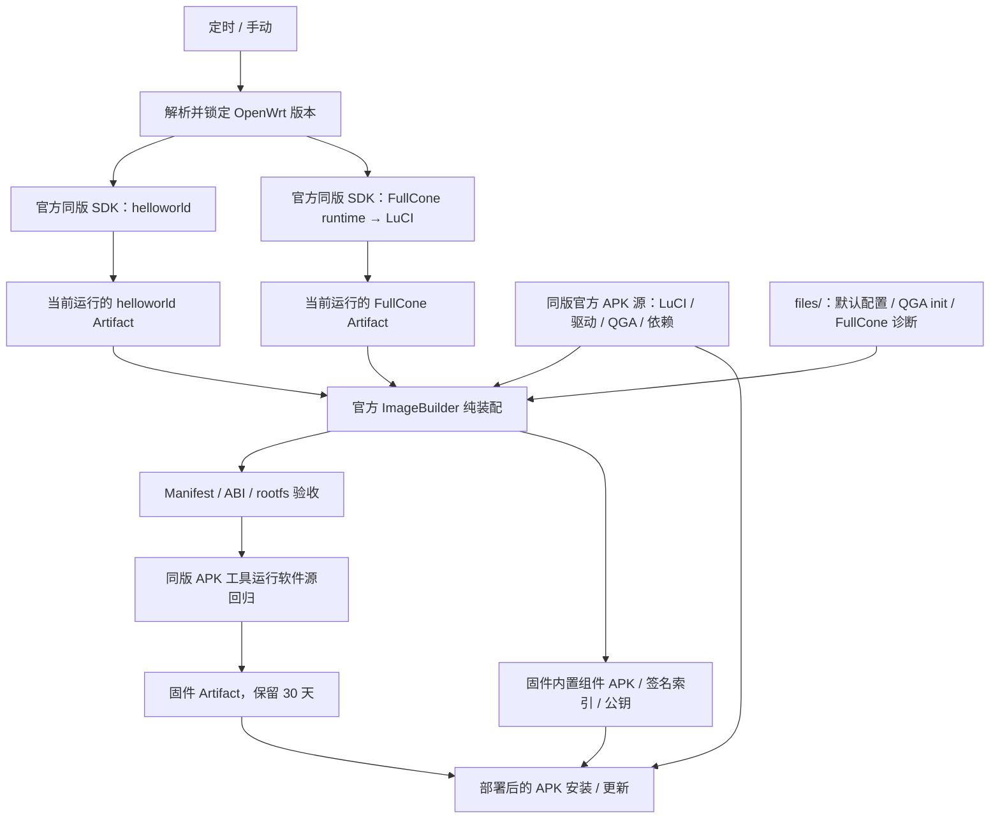

# openwrt-imagebuilder-ci 仓库分析

分析日期：2026-10-09。本文依据仓库源码梳理构建行为。QEMU Guest Agent 的包、驱动和服务行为另依据文中链接的官方来源核实。

## 项目定位与架构

这是一个面向 OpenWrt 官方发行版 `x86/64`、`generic` profile 的固件装配工程。第三方组件使用目标版本的官方 SDK 编译；固件阶段使用官方 ImageBuilder 安装这些组件和官方软件包，并合入 `files/`。仓库不维护 OpenWrt 内核源码或独立完整发行版。

默认镜像是 squashfs 根文件系统、UEFI GPT 引导的 `combined-efi.img.gz`，根分区 2048 MB，GRUB 等待 0 秒。[构建参数](../scripts/build-firmware.sh)允许调整版本、profile、分区和输出路径，但下载地址、rootfs 定位、产物路径仍按 `x86/64` 编写，不能仅修改 `ARCH` 就当作通用多架构构建器。



主工作流等待两个组件构建、验签和索引准备成功后才运行装配。组件通过**同一次 Actions 运行中的 Artifacts**传递，固件阶段把 APK、签名索引和公钥完整装入镜像，部署后使用本地 `@custom file://` 源。固件装配不回退到旧版组件，也不在固件 job 内下载 SDK 或编译组件。

## 目录职责与构建入口

| 位置 | 职责 |
| --- | --- |
| `.github/workflows/daily-build.yml` | 统一版本解析、并行组件构建、下载本次组件、装配、差分缓存与固件 Artifact 上传 |
| `.github/workflows/build-helloworld.yml` | helloworld 组件独立手动 / 可复用构建、验签、签名索引准备与 Artifact 上传 |
| `.github/workflows/build-fullcone.yml` | FullCone runtime 和 LuCI 两阶段构建、验收、签名索引准备与 Artifact 上传 |
| `components/helloworld-builder/` | SSR Plus / Xray / Mihomo 源码构建及输出契约 |
| `components/fullcone-builder/` | FullCone runtime、LuCI 补丁和构建依赖检查工具 |
| `scripts/resolve-version.sh` | 探测最新稳定版，或验证指定版本号格式 |
| `scripts/setup-sdk.sh` | 官方 SDK 下载、SHA256 校验、解包和可选签名密钥注入 |
| `scripts/build-firmware.sh` | 预编译组件验收、ImageBuilder 配置、内置运行时源、镜像生成和最终验收 |
| `scripts/prepare-component-feed.sh` | 签署未签名 SDK APK 并严格验签，生成签名 ADB 索引、身份约束和完整 SHA256 清单 |
| `scripts/runtime-custom-feed.sh` | 验证并内置组件 APK / 签名索引 / 公钥；检查最终 world，在 rootfs 副本中更新源和模拟普通包安装 |
| `scripts/configure-imagebuilder-apk.py` | 调整本地 ImageBuilder 的 `FormatPackages`，完整传递带摘要的 APK 身份约束，保留普通包版本与 ABI 后缀逻辑 |
| `scripts/setup-env.sh` | Ubuntu / Debian / WSL2 的 apt 构建依赖检查与安装 |
| `scripts/diff_manifest.py` | 新旧软件包清单比对，生成文本 / Markdown 差分报告 |
| `config/extra-packages.txt` | 普通官方增量包与 `-包名` 移除项，支持中文注释 |
| `config/custom-feeds.conf` | 可选第三方 APK 源，支持 `${VERSION_SERIES}` 替换；当前没有额外源 |
| `files/` | rootfs 覆盖文件，包括首次默认配置、QGA init 和 `fullcone-check` |
| `Makefile` | 本地 `env`、`build` / `image`、`clean`、`distclean` 入口 |
| `.work/`、`.manifest-cache/`、`bin/` | 工作缓存、历史 Manifest 缓存和最终产物，均被 Git 忽略 |

### 云端入口

[主工作流](../.github/workflows/daily-build.yml)每天 UTC 23:23，即北京时间次日 07:23 调度，也支持手动输入版本、分区大小和 GRUB 等待时间。没有 push 触发器。`concurrency` 设置 `cancel-in-progress: false`，避免取消正在运行的同组构建。三个工作流均使用 `contents: read`，可在私有仓库运行。

两个组件工作流同时提供 `workflow_dispatch` 和 `workflow_call`。当前二者**每次都编译**，缓存仅用于构建工具归档和下载 / 源码目录；`force_rebuild` 参数虽然存在，执行步骤没有使用它作跳过判断。

主工作流的 firmware job 在装配脚本成功后，指定同版 ImageBuilder 的 APK 工具运行 `python3 -m unittest discover -s tests -v` 软件源回归。随后上传固件 Artifact，所有交付均通过 Actions Artifacts 完成。

### 本地入口

`make env` 准备宿主机依赖。`make build` 调用装配脚本，并尝试从 `.work/` 找到已有组件目录；它不会生成组件或下载 CI Artifact。[Makefile 的目录选择](../Makefile)使用首个匹配路径，多版本缓存共存时应显式设置 `HELLOWORLD_COMPONENT_DIR`、`FULLCONE_RUNTIME_DIR` 和 `FULLCONE_LUCI_DIR`。

全新检出需先从同版组件 CI 下载并解压归档，再指定对应的 `OPENWRT_VERSION` 进行装配。手动运行组件构建脚本时，还需执行 `scripts/prepare-component-feed.sh <feed-kind> <component-dir> <sdk-dir>`，三个 kind 为 `helloworld`、`fullcone-runtime` 和 `fullcone-luci`。只有 APK 的旧归档不满足契约；组件版本不一致、缺少签名索引或校验覆盖不完整会被前置校验拒绝。装配需要访问官方工具和普通包的软件源，定制组件源从归档直接内置到固件。具体命令见 [README 本地构建步骤](../README.md#2-本地纯装配构建-ubuntu--debian--wsl2)。

## 版本与官方工具准备

1. [resolve-version.sh](../scripts/resolve-version.sh)优先读取 `downloads.openwrt.org/.versions.json` 的 `stable_version`，失败后从 releases 目录提取数字版本并按版本排序。
2. 指定版本只检查 `X.Y.Z` / `X.Y.Z-rcN` 格式；官方发行目录、工具归档是否存在，在下载阶段确认。
3. 主工作流只探测一次 `latest`，把具体版本传给下游。组件再次调用解析脚本时处理的是具体值，不会重新探测最新版本。
4. [setup-sdk.sh](../scripts/setup-sdk.sh)从官方目标目录找唯一 SDK 候选，读取官方 SHA256，并在下载 / 缓存命中时检查归档后解包。可通过 `CUSTOM_SIGNING_KEY` 注入统一私钥；否则使用 SDK 生成的本地签名密钥。
5. [ImageBuilder 准备](../scripts/build-firmware.sh)同样使用官方 HTTPS 下载与 SHA256。已有解包目录且含 Makefile 时会直接复用，不重新从归档恢复目录。

SDK 与 ImageBuilder 同版锁定保证目标包格式和内核 ABI 的一致性。上游组件源码仍按各自分支更新，目标版本锁定不代表完整源码快照锁定。

## 两个组件构建器

### helloworld

[构建器输入](../components/helloworld-builder/build.sh)包含目标版本、工作目录、输出目录、SDK 路径和可选上游仓库 / ref。默认上游是 `fw876/helloworld` 的 `dev`，每次更新并记录实际 commit。

[SDK feeds 初始化](../components/helloworld-builder/build.sh)先恢复官方发行版固定的 feeds，再增加 helloworld。为保证使用 helloworld 的 xray-core，移除官方 packages 中的对应包定义。缺少 `golang1.27` 时，从 packages `master` 同步 Golang 定义；其余官方 feeds 保持 SDK 固定版本。

三个直接编译目标为 `luci-app-ssr-plus`、`xray-core`、`mihomo`，中文包随 LuCI 语言配置生成。SSR Plus 的额外代理选项按项目需求关闭，naiveproxy 明确排除。构建先清理和预下载，再逐目标编译；并行失败会以 `-j1 V=s` 重试。

输出包含 helloworld feed 产生的 APK、签名公钥、清单与安装约束。软件源准备阶段给核心 `@custom` 目标附加索引中的 APK 身份约束，以区分官方同名同版本包；`v2ray-geoip` 和 `v2ray-geosite` 使用同版官方源。[helloworld CI 验收](../.github/workflows/build-helloworld.yml)还要求 `dns2tcp`、`ipt2socks` 和 `lua-neturl` 出现在仓库清单中。

### FullCone runtime

[runtime 构建器](../components/fullcone-builder/build.sh)每次克隆 ImmortalWrt HEAD，提取 `fullconenat-nft` 模块和 libnftnl / nftables / firewall4 的供体补丁，记录 donor commit、模块源码 commit 和 mirror hash。

它在官方 SDK 的包定义基础上注入补丁、必要的 `autoreconf` 和 `firewall4 → kmod-nft-fullcone` 依赖，不替换官方内核。供体 firewall 默认配置修改被剥离，默认开关由本仓库管理。

[依赖检查与构建调度](../components/fullcone-builder/build.sh)读取 SDK 实际生成的 `tmp/.packagedeps`，要求 firewall4 可传递到 nftables、FullCone 模块和 kernel/linux，nftables 可传递到 libnftnl。之后一次顶层 firewall4 编译覆盖整个调用链，避免独立并行命令重复调度内核前置目标。

输出四个 APK：`kmod-nft-fullcone`、`libnftnl11`、`nftables-json`、`firewall4`。验收不仅检查包名，还检查 FullCone 生成源码、`nft` 的 ELF 与动态链接、实际承载 parser 的 `libnftables.so`、libnftnl expression、fw4 模板和模块文件。模块 APK 的精确 kernel 依赖单独导出供固件验收。

### FullCone LuCI

[LuCI 构建器](../components/fullcone-builder/build-luci.sh)从 SDK 解析官方 LuCI 仓库，并使用目标系列 `openwrt-X.Y` 稳定分支的最新 commit。官方 Git 服务不可达时可使用官方 GitHub 镜像。

三个本地补丁使用 `--fuzz=0` 精确重放：增加 RPC capability、IPv4 / IPv6 FullCone UI 和中文翻译。上游结构不匹配时失败，不跳过补丁。重新编译后输出 `luci-base`、`luci-app-firewall`、`luci-i18n-firewall-zh-cn`，再解包检查 RPC、UI 和非空中文 LMO 文件。

[FullCone CI](../.github/workflows/build-fullcone.yml)在同一 SDK 中顺序运行 runtime、LuCI，使用独立输出子目录，并检查两阶段签名公钥一致。

## 组件产物契约、内置软件源与 Artifact 流转

| 文件 | 含义 |
| --- | --- |
| `<name>-<version>.apk` | SDK 生成的软件包，软件源准备阶段补签并严格验证后交付；归档、ImageBuilder 与固件内置源均保留原文件名 |
| `repository-packages.txt` | 本地仓库实际包名与版本，格式为 `name=version` |
| `install-packages.txt` | 最终固件应安装的包名清单 |
| `install-constraints.txt` | ImageBuilder 安装目标，核心组件使用 `@custom` 并固定 APK 身份，防止同名同版本官方包替代 |
| `*-public-key.pem` | 对应 SDK 签名公钥，用于 ImageBuilder 与运行时的软件源 / APK 验签 |
| `SHA256SUMS` | 软件源准备后覆盖 APK、索引、公钥、构建信息及安装 / 仓库清单的 SHA256 清单 |
| `*-packages.adb` | 已签名的 helloworld、FullCone runtime 或 LuCI 软件源索引，三者分别命名 |
| `BUILD-INFO.txt` | 目标版本 / 架构、上游提交和包版本等组件信息 |
| `kernel-dependency.txt` | FullCone runtime 独有，记录模块的精确 kernel ABI 依赖 |

helloworld 归档为 `openwrt-component-helloworld-${version}-x86_64.tar.gz`，文件直接位于归档根目录。FullCone 归档为 `openwrt-component-fullcone-${version}-x86_64.tar.gz`，内部是 `runtime/`、`luci/` 两个独立目录，避免同名元数据覆盖。

两个组件工作流在原有 Hard Validation 后调用软件源准备脚本。OpenWrt 的 [单包打包规则](https://github.com/openwrt/openwrt/blob/openwrt-25.12/include/package-pack.mk#L554)使用未附加签名参数的 `apk mkpkg`；[CONFIG_SIGNED_PACKAGES](https://github.com/openwrt/openwrt/blob/openwrt-25.12/package/Makefile#L117) 控制索引签名，不能保证单包 compile 输出已签名。因此准备脚本先验证原始 SHA256 与密钥，在临时副本中对没有签名块的 APK 校验内容并以 SDK 私钥显式补签；已有但不可信或损坏的签名仍拒绝，不通过重签掩盖错误。`--allow-untrusted` 仅用于未签名构建产物的内容校验与首次签名，最终 APK、索引和运行时验签均保持严格。补签后必须独立严格验签，因为 [apk-tools 3.0.5 adbsign](https://github.com/alpinelinux/apk-tools/blob/v3.0.5/src/app_adbsign.c#L83) 可能报错仍返回 0。

全部 APK 验签成功后，使用 SDK 的 `apk` 生成并签名索引，再追加 `@custom` 目标的 APK 身份约束。hash pin 取自生成的索引，保护 FullCone / LuCI 与官方同名同版本包之间的差别；不得仅用普通版本号代替。对签名后的 APK 重新计算文件 SHA256，安装约束及所有关键元数据统一加入校验清单；全部准备成功后才回写组件目录。

索引使用 APK 工具默认的 `<name>-<version>.apk` 文件名模板，组件归档和固件内置源保存相同文件名与字节。软件包内部版本、签名及身份保持一致，每个组件目录的同名包只允许一个版本。不存在额外的运行时 URL 元数据。

组件 APK、签名索引和完整 SHA256 清单准备成功后[上传 Artifacts](../.github/workflows/build-fullcone.yml)，保留 1 天，并使用 `overwrite: true` 支持重跑同一运行中的组件 job。主工作流通过[当前运行内的 Artifact 名](../.github/workflows/daily-build.yml)下载，检查预期归档、子目录和签名索引，再调用装配脚本。只重跑固件 job 可以复用同次运行中成功且未过期的组件 Artifact。已经部署的组件源随固件保留，不依赖 Artifact 的保留期。

安装前会把三个目录的 APK 复制到 ImageBuilder `packages/`，同名 APK 冲突立即失败，导入公钥，配置构建期 `@custom file://.../packages.adb`。解析增量包后，以组件约束替换同名条目，保证组件核心包来自本次本地仓库。`runtime-custom-feed.sh stage` 对三类组件检查版本、架构、元数据、完整 SHA256 覆盖、APK 与索引签名、索引包集合和身份约束，再将 APK 与签名索引复制到覆盖目录的 `/usr/share/custom-apk/<kind>/`，公钥复制到 `/etc/apk/keys/`。

身份约束格式为 `name@custom><Q1...=`，摘要取自 ADB 索引条目的身份，而非 APK 文件的普通 SHA256。官方 ImageBuilder 的 `FormatPackages` 会按 `=` 拆分包版本，未加引号的 `><` 也会被 shell 当作重定向。[装配前的兼容处理](../scripts/build-firmware.sh)调用 `configure-imagebuilder-apk.py`，仅对这种身份约束保留完整参数并加 shell 引号，普通版本约束和 ABI 后缀继续采用原逻辑。修改可重复执行；上游 `FormatPackages` 结构无法识别时会停止装配。

运行时覆盖文件为 `/etc/apk/repositories.d/custom-components.list`，包含三条本地索引地址：

```text
@custom file:///usr/share/custom-apk/helloworld/helloworld-packages.adb
@custom file:///usr/share/custom-apk/fullcone-runtime/fullcone-runtime-packages.adb
@custom file:///usr/share/custom-apk/fullcone-luci/fullcone-luci-packages.adb
```

[生成覆盖文件](../scripts/build-firmware.sh)时先复制项目 `FILES_DIR` 到临时目录，再写入当前组件的 APK、索引、公钥和源配置，由 `make image` 合入镜像。固件保留安装时的 world 标签和 APK 身份约束，运行时存在与之对应的真实本地仓库，因此添加官方普通包时不会再因缺失 `@custom` 标签而拒绝事务。

[最终运行时源验收](../scripts/build-firmware.sh)调用 `runtime-custom-feed.sh verify`，逐字节检查 rootfs 中的源配置、公钥、索引和全部 APK，与组件归档比对并严格验签，核对定制 world 身份约束集合。随后在 rootfs 副本和独立缓存中执行 `apk update` 与 `apk add --no-scripts --simulate coremark`，要求事务成功且不替换定制组件；待交付 rootfs 不被修改。这是宿主机上的求解器检查，不启动固件。

组件签名无需必填额外 secret：默认使用 SDK 生成密钥，并把对应公钥固定在固件中。`CUSTOM_SIGNING_KEY` 仍可选，用于希望多个构建采用同一签名身份的场景。工作流不需要 `gh`、额外 GitHub token 或写入仓库内容的权限，固件运行时从本地读取组件索引和 APK。

## 首次默认配置与最终验收

[99-custom-defaults](../files/etc/uci-defaults/99-custom-defaults)集中管理首次启动配置：LAN 为 `192.168.2.1/24`，WAN 为 PPPoE，开启 packet steering / RFS；关闭 WAN6 自启、IPv6 请求 / 委派、设备 IPv6、RA / DHCPv6 / NDP 和 DNS AAAA 应答，同时保留协议栈、包和防火墙规则用于恢复。

防火墙默认启用 IPv4 FullCone、关闭 FullCone6，并执行 `fullcone-check syntax`。Dropbear 使用 LAN 设备绑定和仅公钥认证；系统时区为上海，配置国内 NTP，LuCI 使用中文和 footstrap。关键 UCI 写入失败会退出，启动流程保留此脚本以便下次重试，成功后统一提交并删除。

固件阶段的校验分为两层：

- **Manifest**：要求组件安装包存在，拒绝 naiveproxy；精确比对 FullCone LuCI 包版本，并比较模块 kernel 依赖与固件 kernel。[QGA 包校验](../scripts/build-firmware.sh)另要求 `qemu-ga` 与 `virtio-console-helper`。
- **rootfs**：检查四份 GeoData、LuCI capability 与 FullCone UI、中文 LMO、内核模块、nft ELF / 共享库、FullCone parser 和 fw4 模板。[QGA rootfs 校验](../scripts/build-firmware.sh)要求代理、init、两个 hotplug 脚本非空且可执行，代理为 ELF，init 与仓库维护文件完全一致，并要求 `S99qemu-ga` 链接指向 `../init.d/qemu-ga`。定制源验收另检查本地源路径、公钥、索引、全部 APK 与 world 身份，并在副本中验证普通包安装事务。

构建阶段做静态装配验收，不启动生成的固件。FullCone 的运行态、热重启及 LuCI RPC 可由固件内 `fullcone-check status` / `restart` / `luci` 验证；QGA 的实际宿主机通信通过 PVE / libvirt 部署后查询确认。

交付目录 `bin/` 包含带时间戳的压缩 EFI 镜像、镜像 `sha256sums`、包 Manifest、差分报告和三份组件 `*-build-info.txt`。历史 Manifest 通过 Actions cache 保存，下一次构建生成包新增 / 移除 / 版本变化报告。固件通过 Actions Artifact 交付，保留 30 天。

## QEMU Guest Agent 的接入依据

QGA 是官方包，可直接加入 `extra-packages.txt`，跟随当前 ImageBuilder 的同版官方源安装。`qemu-ga` 依赖 `virtio-console-helper`，所以不增加第三个组件工厂。[官方软件包定义](https://github.com/openwrt/packages/blob/openwrt-25.12/utils/qemu/Makefile)包含代理二进制、init 和 QGA hotplug 的安装规则。

官方 x86/64 内核配置已包含 `CONFIG_VIRTIO_CONSOLE=y`、`CONFIG_VIRTIO_PCI=y`，所需传输驱动内建，不新增 `kmod-virtio-console`。依据：[官方 x86/64 配置](https://github.com/openwrt/openwrt/blob/openwrt-25.12/target/linux/x86/64/config-6.12)。

官方 init 使用 `START=99` 和 procd，不提供 QGA UCI 配置。[仓库 init 覆盖](../files/etc/init.d/qemu-ga)保留此服务管理方式，并在启动前要求 `/dev/virtio-ports/org.qemu.guest_agent.0` 为字符设备：实体机与未提供通道的虚拟机不会创建持续 respawn 的代理进程。官方 helper 在设备加入时建立命名端口，官方 QGA hotplug 再次调用服务启动，因此仍支持设备稍晚出现的情况。依据：[官方 init](https://github.com/openwrt/packages/blob/openwrt-25.12/utils/qemu/files/qemu-ga.init)、[官方 helper](https://github.com/openwrt/packages/blob/openwrt-25.12/utils/qemu/files/00-virtio-ports.hotplug)、[官方 QGA hotplug](https://github.com/openwrt/packages/blob/openwrt-25.12/utils/qemu/files/10-qemu-ga.hotplug)。

该接入不依赖 `99-custom-defaults`，FullCone 首次检查是否成功不会影响 QGA 的服务启用。宿主机仍需配置对应通道，并通过实际通信验收；详见 [README QGA 部署与验收](../README.md#qemu-guest-agent-部署与验收)。

使用自定义 `FILES_DIR` 时，也需包含与仓库 `files/etc/init.d/qemu-ga` 一致的启动脚本；最终 rootfs 会与项目维护的脚本逐字比较，以确认通道保护确实进入镜像。

## 内置软件源部署与旧固件恢复

首次部署需要重新构建完整固件，使组件 APK、签名索引、公钥和源配置进入镜像。独立组件工作流只交付组件 Artifact；已有固件不会因仓库代码更新自动获得内置源。代码更新后应创建新的工作流运行；重跑旧运行仍使用旧提交。

内置源与这份固件的组件版本和身份固定匹配，不会自动追踪新组件。升级内核、FullCone 或其他定制组件时，应使用同版工具链构建并部署完整新固件。APK 原始归档和索引进入镜像会增加固件及根文件系统空间占用，设置根分区大小时需为组件源和普通包安装留出余量。

Actions Artifact 到期、仓库改名或转为私有均不影响已经部署的本地组件源。应保留 `/usr/share/custom-apk/`、三条 `@custom file://` 配置及对应公钥。旧固件若手动恢复，需要拿到与已安装包身份、签名公钥和内核 ABI 完全匹配的原始组件 APK 与索引，不能直接使用任意新构建的组件目录。

首次部署后可运行 `apk update` 与 `apk add --simulate coremark` 验证索引读取和普通包事务。本地组件源无需联网；普通包及其依赖仍要求路由器能访问 OpenWrt 官方软件源。构建时的静态验收和模拟安装没有取代设备启动、网络连通性及实际包安装检查。

## 已知限制与可改进项

以下是当前仍存在的源码行为与验证限制。

| 项目 | 源码证据 | 实际影响 |
| --- | --- | --- |
| `force_rebuild` 输入未使用 | [helloworld workflow 定义](../.github/workflows/build-helloworld.yml)、[无条件编译步骤](../.github/workflows/build-helloworld.yml)；FullCone 对应为 [参数](../.github/workflows/build-fullcone.yml)、[编译](../.github/workflows/build-fullcone.yml) | 输入 true / false 当前都执行编译；缓存没有提供“已有组件就跳过”行为。README 已按实际行为修正。 |
| 接受版本格式不等于支持全部发行系列 | [版本格式检查](../scripts/resolve-version.sh)、[ImageBuilder 归档格式](../scripts/build-firmware.sh)、[APK 本地仓库](../scripts/build-firmware.sh) | 实现按 25.12+ 的 zstd 工具归档、APK / ADB 和内核依赖格式设计；旧版和 snapshot 没有兼容处理。 |
| CI 导出的 SDK 来源字段丢失 | [setup-sdk 只输出路径](../scripts/setup-sdk.sh)、[helloworld 外部 SDK 分支](../components/helloworld-builder/build.sh)、[FullCone 对应分支](../components/fullcone-builder/build.sh) | 官方 SDK 在准备阶段确实检查 SHA256，但组件 BUILD-INFO 的归档 / SHA256 被记成 `external-sdk`，不能直接从交付元数据追溯真实 SDK 归档。 |
| LuCI 对 runtime 元数据路径的假设与 CI 不同 | [CI 输出目录](../.github/workflows/build-fullcone.yml)、[LuCI 读取路径](../components/fullcone-builder/build-luci.sh) | runtime 实际在 `fullcone-component-${version}/runtime`；LuCI 查找 `fullcone-packages-${version}`，正常 CI 退回 donor Git commit，但 `nft-fullcone source commit` 保持 `unknown`。 |
| 镜像缺失没有独立硬校验 | [镜像收集](../scripts/build-firmware.sh)、[SHA256 失败被忽略](../scripts/build-firmware.sh) | 后续要求 Manifest 和 rootfs，却没有明确要求至少一个交付镜像且校验和非空。缺少镜像时，不能仅靠成功结束判断交付完整。 |
| 动态上游不保证位级重现 | [helloworld 分支](../components/helloworld-builder/build.sh)、[ImmortalWrt HEAD](../components/fullcone-builder/build.sh)、[LuCI 稳定分支 HEAD](../components/fullcone-builder/build-luci.sh) | 同一 OpenWrt 版本的不同构建可能获取不同源码；已记录组件 commit，但复现还需要锁定这些输入。 |
| 固件构建参数没有独立元数据文件 | [只导出组件信息](../scripts/build-firmware.sh) | 交付中的三份元数据描述组件，没有统一记录此次固件的分区大小、GRUB 参数、覆盖文件与仓库提交。 |

普通增量包目前也没有统一的逐包 Manifest 硬校验；专门验收覆盖组件和 QGA，不能把通过验收理解为所有可选配置项都经过同等深度检查。

## 验证边界

`@custom` 软件源回归位于 [tests/test_custom_feed.py](../tests/test_custom_feed.py)，32 项已在本地全部通过，使用真实 OpenWrt ImageBuilder APK v3 工具和临时签名密钥，验证以下范围：

- 三类组件未签名 SDK APK 的首次补签、严格验签和真实安装；签名后更新文件 SHA256 并保持安装身份，重复准备不改写已签名 APK。损坏的未签名内容即使重算原 SHA 仍拒绝，`adbsign` 返回成功却不签名时也必须失败且保留原产物。
- 三类组件的签名索引、正确的 APK 身份约束和完整 SHA256 覆盖，以及错误密钥、篡改 APK、缺失包、错版 / 错架构的拒绝行为。
- 官方源与定制源存在同名同版本、不同内容 APK 时，普通包安装和升级保持定制身份；移除 `@custom` 源可重现原始 `missing repository tag` 故障。
- 从实际 ImageBuilder Makefile 提取 `FormatPackages` 并执行 GNU make，确认完整身份约束、普通版本约束及 ABI 后缀正确传入程序，兼容修改可重复执行，未知格式会失败。
- `runtime-custom-feed.sh` 的三条本地源配置、公钥、内置 APK 与签名索引、world 和 rootfs 副本模拟安装；签名和 APK 求解使用真实工具。错误索引、损坏或缺失的 APK、校验覆盖缺失、错误公钥或身份必须被拒绝，并确认原 rootfs 不被修改。
- 含 `~` 版本的软件包保留标准 `<name>-<version>.apk` 文件名与内部版本，由真实 APK 工具从本地源读取并严格验证。

运行命令为：

```bash
python3 -m unittest discover -s tests -v
```

测试默认查找 `.work/` 中的 OpenWrt SDK / ImageBuilder APK v3 工具，也可通过 `CUSTOM_FEED_APK` 指定路径。真实 APK 测试需要该工具及 `openssl`；ImageBuilder 参数测试需要已解压的官方 Makefile 和 GNU make。缺少这些前置条件会跳过相关测试，不能将跳过视为通过。

本地签名和求解器回归没有代替完整固件构建。提交后需创建新的 CI 运行，确认组件 Artifact、最终镜像和内置源验收均成功，再部署到设备检查实际 `apk update` 与普通包安装。重跑旧运行仍使用旧提交；本地测试通过不表示新固件已经构建或完成设备验收。

仓库工作流的主要质量检查嵌入组件构建和固件装配脚本，没有完整虚拟机启动验收 job。QGA 的端口检查、启动请求和 procd 调用可通过本地模拟验证，实际 PVE / KVM 通信仍需部署后的宿主机 `ping` 与接口查询。运行方法、平台前置条件及 ESXi 的工具区别均见 README。
